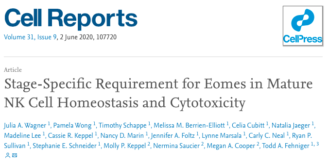

<!-- toc_float: true (is what makes the TOC nice looking) -->

"Knit" does the same as "build website" but only to current .rmd file rather than all .rmd files in project.

# This is not a comment in RMarkdown
<!-- This is a comment. It doesn't appear in final website. --> 

<!-- Heading sizes -->

# Big Heading {#heading1}
## Smaller heading
### Even smaller
#### Teensy

<!-- Inline Text formatting -->
To make text bold, use **double asterisk** or __double underscore__.

To make text italic, use *asterisk once* or _underscore once_.

To make text superscript, use ^caret^. For multiple words, ^code\ like\ this^.

To make text subscript, use ~tilde~.

To mark text as inline code use `backticks`.

To make text strikethrough, use ~~double tilde~~.

# Links
Link to a webpage - [link to shared document](https://docs.google.com/document/d/1N8gPLlwWvviLO4S4v5DgsZrafEeV2r4IeHu3KHDrWNc/edit#).
Link to headings [here](#heading1)

# Footnotes

To indicate a footnote use[^1]. The session today is[^2]

# Lists

Ordered lists:

1. Item 1
2. Item 2
    a. 2a
        i. 2ai <!-- use 2 tabs-->
        
Unordered lists (*, +, -):

- Item 1
- Item 2
    - item 2.i

Task list:

- [ ] an unchecked item
- [x] a checked item <!-- this will not show until rendered in github -->

\

# Inserting figures



\

# Tables

| Column 1 | Column 2 | Column 3 |
| -------- | -------- | -------- |
| Item 1 | Item 2 | Item 3 |
| Item 4 | Item 5 | Item 6 |


| Column 1 | Column 2 | Column 3 |
| :--------- | :----------: | ----------: |
| Left align | Centre align | Right align |

# Block of text

>Example

# Code block

``` 
print("Hello world")
x <- c(5,7)
```

# Table of contents
<!-- need to add to top of page -->

# References example

<!-- YAML section at top requires bibliography -->

Citation to my paper @cardona2014 and @cardona2019 .


\
\
\
\
\
\
\
\

[^1]: this is the first footnote
[^2]: quite cool
